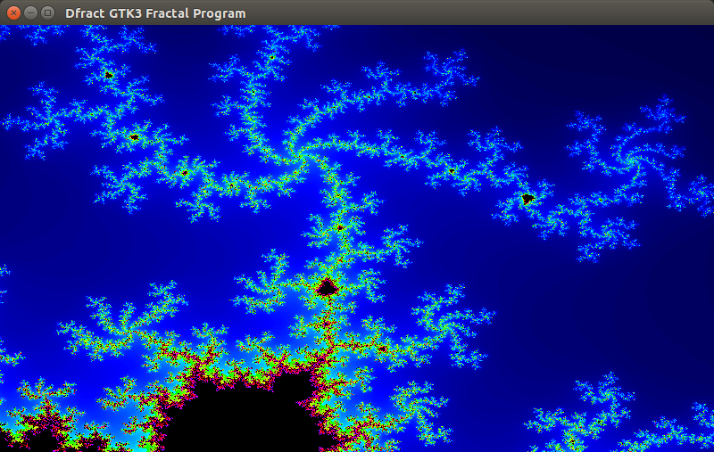

dfract
======

[](https://github.com/SingingBush/dfract/actions/workflows/dlang.yml)

GTK application written in [D](http://dlang.org). This is a work in progress - nowhere near completion!

- [x] Zoom in or out of the mandelbrot using the mouse wheel or the plus/minus keys. (needs additional work)
- [x] Use arrow keys for panning left/right/up/down. (needs additional work)
- [ ] Click and drag the mouse to select an area to zoom in on - in progress
- [ ] Save/Load state



The project uses the [DUB](http://code.dlang.org/download) build tool to handle dependencies and compile. If you already have D and dub installed you can compile the project by simply cloning the repository and running `dub` in the root of the project. By default dub will use the dmd compiler for a debug build, for a more performant release build use ldc or gdc:

```
dub --build=release --compiler=gdc
```
